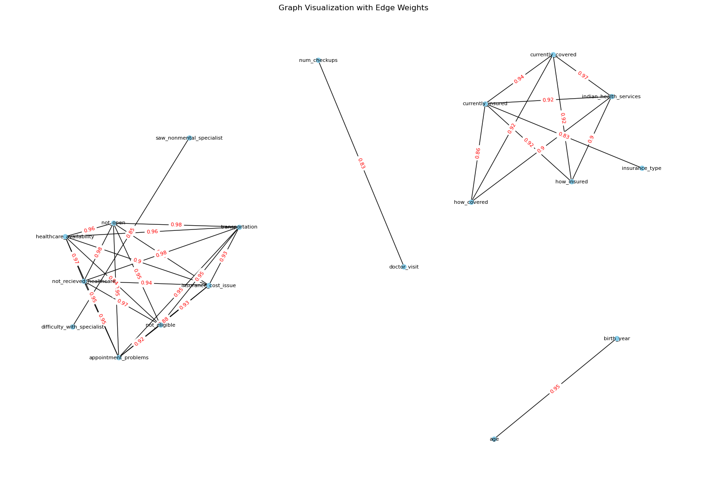

# Healthy Bodies, Bright Minds: "The impact of Healthcare Access on Children's Academic Performance"
Team: 
June 1, 2024 

Erdos Institute Data Science Boot Camp project  
 
## Project Description
This project involves the investigation and evaluation of how different factors contributing to children's access to healthcare affects their academic performance. In particular, this project investigates the connection between healthcare access and school absenteeism.

## Executive summary
Healthcare access plays a major role in a child’s wellbeing and development. There are many factors contributing to children’s access to healthcare from financial barriers, such as health insurance coverage and family income, to nonfinancial barriers, such as family structure, cultural factors, health literacy of the parents, and the availability of healthcare providers. Healthcare access is shown to impact several aspects of child development, including physical, emotional, and mental health, as well as growth, and academic performance. 

Health care access is the ability to obtain healthcare services such as prevention, diagnosis, treatment, and management of diseases, illness, disorders, and other health-impacting conditions. It is one of the social determinants of health, and can affect a wide range of functioning, quality of life, and health outcomes. We are interested in exploring in particular the effect of healthcare access on academic performance. “Children with Medicaid access, for instance, have been found to have better grades, fewer missed days, better graduation rates, and higher long-term earnings.”1 

Our dataset consists of two parts: health dataset and education dataset. For the health data, we use The National Survey of Children’s Health (NSCH) dataset to generate our “access to healthcare” features. These will include features like children’s current health care coverage, how much money was paid for health related care, insurance type, government assistance, how often the child is allowed to see providers, whether there was a time the child needed healthcare but did not receive it, etc. For the education data, we plan to use a combination of two datasets: we will use the The National Survey of Children’s Health (NSCH) again to extract features like grades received in school across all subjects, days missed in school, and whether the children do all required homework. We also plan to use data from theEDFacts centralized data governed by the U.S. Department of Education.  In the academic achievement data (Mathematics FS175/ DG583 and Reading/Language Arts FS178/ DG584) posted by Office of Elementary and Secondary Education (OESE)states provide the count of students taking each type of assessment and scoring in each performance level by subject, and grade. 

The primary hypothesis of the project is that the academic performance features (APF), measured by test scores and number of missed school days, is negatively impacted by student access to health care, measured by the previously defined “access to healthcare” features (AHF). 

Despite the great effort made in healthcare access since the passage of the Affordable Care Act, access to quality health care is still affected by socioeconomic status. “Children from economically disadvantaged communities often lag behind their peers in more affluent communities in access to quality health care.”3  This is one of the reasons why we predict that several confounding factors will interact with each other to create a complex system that influences the relation between our variables. 

The primary stakeholders of this investigation are listed below. This group forms an expansive set and one can easily add to the list we have provided.   

Stakeholders:
State representatives 
National representatives 
Department of health 
Department of education 
Parents and children 
Educators 
Medical community 
Policy makers

The impact of “healthcare access on children’s academic performance” is clearly a complicated subject and may not possess a definitive conclusion.  There are many facets to education and the nut certainly has not been cracked by any specific institution to the best of our knowledge.  That being said, there are coarse markers that can at least provide some sense as to whether a model is functioning reasonably well.  For this investigation, we will look at the following key performance indicators (KPI).  

Key Performance Indicators (KPI):
The ability of the model to predict the likely range of a given academic performance feature (APF) for an initial set of access to healthcare features (AHF).
If we study the binary outcome of APFs being above or below national/local averages, we can for example use the F1 score to assess the predictive performance of the model.  
Assuming our model is capable of returning a probability distribution for each APF given an initial set of AHF we may use the Kullback–Leibler (KL) divergence to compare the predicted probability distribution to the observed distribution from our dataset.
The usual metrics for errors: Mean Squared Error (MSE), Mean Absolute Error (MAE) and Root Mean Squared Error (RMSE).  These can be applied to prediction errors in the APFs. 
Of course this list is not exhaustive and is subject to change as the project develops. 

## Writing first, will put them in different sections later! 

## Correlation testing between predicting variables

It is important to understand the correlation between different variables and features in our model  for several reasons:
- Feature selection: by analyzing correlations, we can identify redundant features, and select a minimal set of important features that best represent our target varaibles. This prevents overfitting and improves our model's ability to generalize.
- Reducing bias: by identifying correlation between input features and sensitive attributes, we can evaluate our model for potential biases, monitor feature importance, and apply techniques like fair representation learning to mitigate bias.
- Detecting multicollinearity: highly linearly correlated features can negatively impact our models by increasing invariance and making it difficult to determine the significance and effect of individual predictors. 

The goal of this section is to automatically identify which features in our data set are highly correlated with each other, and systematically remove them. We start by using the clean version of our data set (that contains 84 features), and we drop some features that don't make sense to investigate correlation with, like the state and their FIPS code, as well as our target variable "days missed". We then create a series with values equal to the correlation of the multiindex of a pair of features, and we look at pair of features whose correlation is higher than a certain threshold, that we determined to be 0.8. By defining the edges to be the indices of the different correlated features, and the weight to be the correlation between two pairs, we are able to create a graph from our edges and weights.

<!-- -->

In addition to clusters of two, the graph above shows two large clusters in our features:

| Cluster 1 | Cluster 2                                                                                   |
|------|-----------------------------------------------------------------------------------------|
| how_covered  |not_received_healthcare |
| indian_health services  | appointment_problems                                                  |
|currently_insured  | healthcare_availability                                                                             |
|insurance_type  | not_open                                                                            |
| currently_covered  | insurance_cost_issue                                                                              |
| how_insured  | not_eligible                                                          |
|  | transportation                                                                              |
                                                   
We compare the percent of missing entries for each our feature, and we decide to drop: 
- 'num_checkups' (this has more missing data than 'doctor_visit')
- 'birth_year' (this has more missing data than 'age')
- 'saw_nonmental_specialist' ('difficulty_with_specialist' is more related to healthcare access)

We should **keep** the following features in their respective cluster:
- 'currently_insured' (most directly related to healthcare access and is connected to all other features in cluster)

## Data wrangling
In this section, we will 
### Data selection

### Data cleaning

### Exploratory data analysis

## Proposed modeling approach 

### Initial model choice

### Model selection 

### Model evaluation 

### Model analysis

## Conclusion

## Possible future directions 

## Appendices

### Data repository

