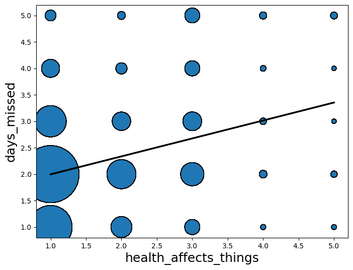
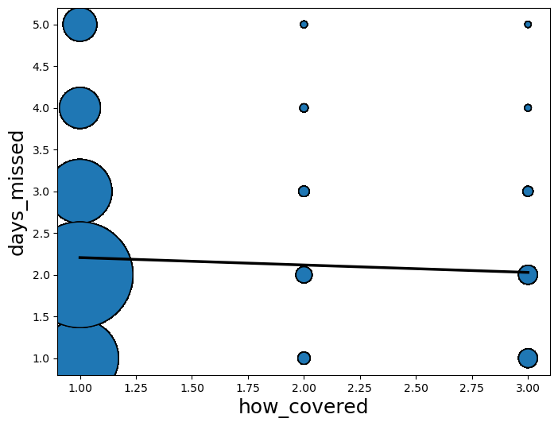
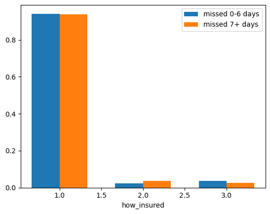
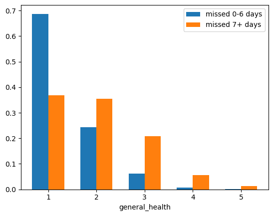
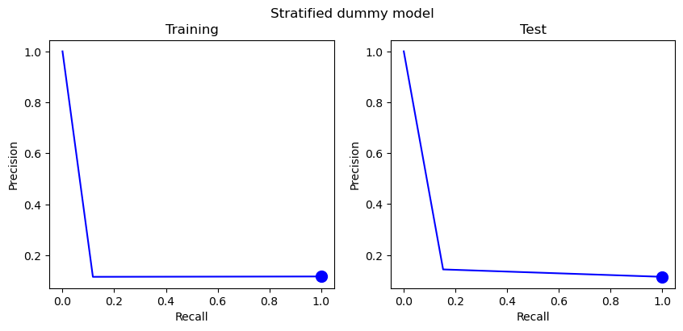
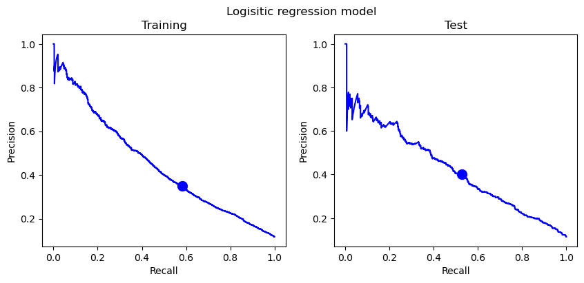
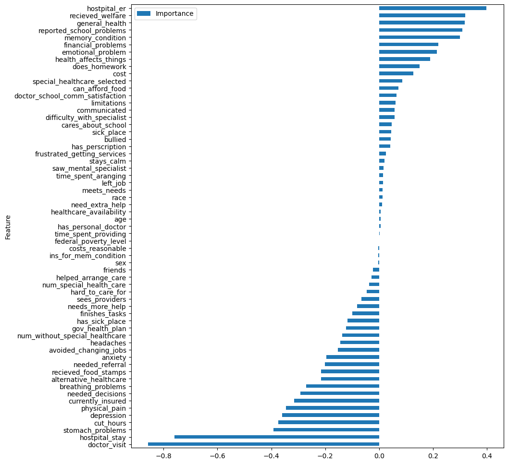
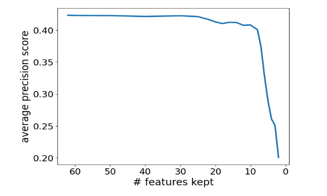
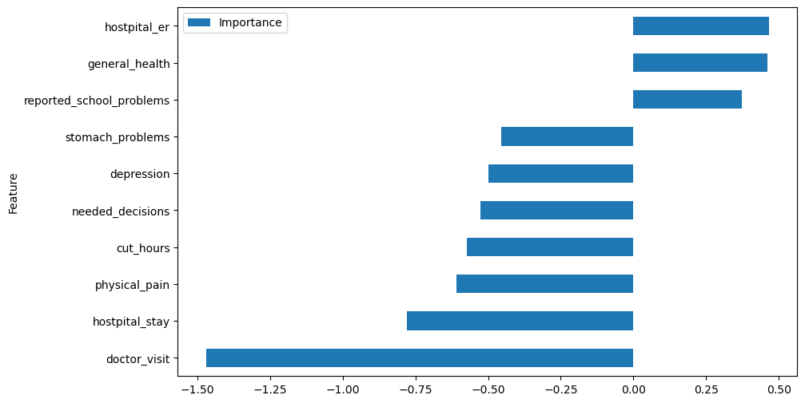
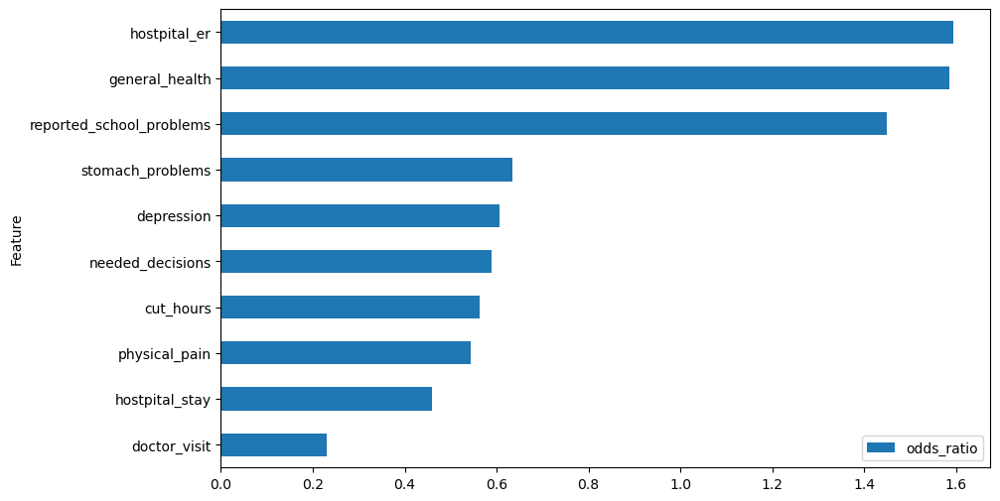

# Healthy Bodies, Bright Minds: "The impact of Healthcare Access on Children's Academic Performance"
Team: 
June 1, 2024 

Erdos Institute Data Science Boot Camp project  
 
## Project Description
This project involves the investigation and evaluation of how different factors contributing to children's access to healthcare affects their academic performance. In particular, this project investigates the connection between healthcare access and school absenteeism.

## Executive summary
Healthcare access plays a major role in a child’s wellbeing and development. There are many factors contributing to children’s access to healthcare from financial barriers, such as health insurance coverage and family income, to nonfinancial barriers, such as family structure, cultural factors, health literacy of the parents, and the availability of healthcare providers. Healthcare access is shown to impact several aspects of child development, including physical, emotional, and mental health, as well as growth, and academic performance. 

Health care access is the ability to obtain healthcare services such as prevention, diagnosis, treatment, and management of diseases, illness, disorders, and other health-impacting conditions. It is one of the social determinants of health, and can affect a wide range of functioning, quality of life, and health outcomes. We are interested in exploring in particular the effect of healthcare access on academic performance. “Children with Medicaid access, for instance, have been found to have better grades, fewer missed days, better graduation rates, and higher long-term earnings.”1 

Our dataset consists of two parts: health dataset and education dataset. For the health data, we use The National Survey of Children’s Health (NSCH) dataset to generate our “access to healthcare” features. These will include features like children’s current health care coverage, how much money was paid for health related care, insurance type, government assistance, how often the child is allowed to see providers, whether there was a time the child needed healthcare but did not receive it, etc. For the education data, we plan to use a combination of two datasets: we will use the The National Survey of Children’s Health (NSCH) again to extract features like grades received in school across all subjects, days missed in school, and whether the children do all required homework. We also plan to use data from theEDFacts centralized data governed by the U.S. Department of Education.  In the academic achievement data (Mathematics FS175/ DG583 and Reading/Language Arts FS178/ DG584) posted by Office of Elementary and Secondary Education (OESE)states provide the count of students taking each type of assessment and scoring in each performance level by subject, and grade. 

The primary hypothesis of the project is that the academic performance features (APF), measured by test scores and number of missed school days, is negatively impacted by student access to health care, measured by the previously defined “access to healthcare” features (AHF). 

Despite the great effort made in healthcare access since the passage of the Affordable Care Act, access to quality health care is still affected by socioeconomic status. “Children from economically disadvantaged communities often lag behind their peers in more affluent communities in access to quality health care.”3  This is one of the reasons why we predict that several confounding factors will interact with each other to create a complex system that influences the relation between our variables. 

### Stakeholders
The primary stakeholders of this investigation are listed below. This group forms an expansive set and one can easily add to the list we have provided.   

- State representatives 
- National representatives 
- Department of health 
- Department of education 
- Parents and children 
- Educators 
- Medical community 
- Policy makers

### KPIs 
The impact of “healthcare access on children’s academic performance” is clearly a complicated subject and may not possess a definitive conclusion.  There are many facets to education and the nut certainly has not been cracked by any specific institution to the best of our knowledge.  That being said, there are coarse markers that can at least provide some sense as to whether a model is functioning reasonably well.  For this investigation, we will look at the following key performance indicators (KPI).  

Key Performance Indicators (KPI):
The ability of the model to predict the likely range of a given academic performance feature (APF) for an initial set of access to healthcare features (AHF).
If we study the binary outcome of APFs being above or below national/local averages, we can for example use the F1 score to assess the predictive performance of the model.  
Assuming our model is capable of returning a probability distribution for each APF given an initial set of AHF we may use the Kullback–Leibler (KL) divergence to compare the predicted probability distribution to the observed distribution from our dataset.
The usual metrics for errors: Mean Squared Error (MSE), Mean Absolute Error (MAE) and Root Mean Squared Error (RMSE).  These can be applied to prediction errors in the APFs. 
Of course this list is not exhaustive and is subject to change as the project develops. 

## Problem and data selection
We are interested in exploring the effect of healthcare access on children's academic performance. Research shows that school absences have negative impact on grades and student's academic achievement. For that reason, we will use absenteeism as a metric of student educational outcome. We use the dataset from the National Survey of Children's Health (NSCH) dataset, and we extract from this dataset two sets of variables:
- Predicting variables:
     - "access to healthcare" features (e.g. children's current healthcare coverage, how often the child is allowed to see providers, etc),
     - health-related features (e.g. depression, children's general health),
- Target variable:
     - "days missed in school". We convert days_missed into a categorical variable: 0 means 0-6 days missed, 1 means 7+ days missed.

## Feature selection 1.0

Our dataset is a high-dimensional dataset with 29433 rows and 448 columns (448 features). Feature selection is a [crucial](https://hex.tech/use-cases/feature-selection/#:~:text=Feature%20selection%20simplifies%20models%20by,to%20stakeholders%20or%20regulatory%20bodies.) step for our model as it reduces overfitting, improves accuracy, reduces computational costs, and aids interpretability. We use **three** different methods for feature selection: 
- **Handpick**: we parse through the 447 features in the NSCH dataset, picking any related to health and healthcare access,
- **Correlation analysis with the target variable** (supervised filter method): we compute the linear correlation between each feature and the number of days missed, keeping features with high correlation,
- **Histogram analysis** (supervised filter method): for each feature, we measured the change in histogram shape among children with low and with high absenteeism, keeping features with sufficiently different histograms. 

For the **correlation analysis with the target variable**, let's compare for instance the following two features:
- "health_affects_things",
- "how_covered".
  
Observing the correlation results, we notice that "health_affects_things" displays a high correlation with the number of days missed, whereas "how_covered" exhibits a low correlation. This would suggest dropping "how_covered" and keeping "health_affect_things". 
  
<!-- -->   <!-- --> 

Turning to the **histogram analysis**, let's consider the following two features:
- "how_insured", which indicates how many of the past 12 months the child was insured. Looking at NSCH_dictionary.csv in data, we know that:
        - 1 = Insured all 12 months, 2 = Insured during the past 12 months but with gaps in coverage, 3 = No coverage past 12 months
- "general_health", which denotes the general health of a child. We know that:
        - 1 = Excellent, 2 = Very Good, 3 = Good, 4 = Fair, 5 = Poor

Upon examining the histograms of these features, it becomes evident that while "how_insured" does not show a significant disparity in histogram shape between low and high absenteeism, "general_health" does.  This would suggest keeping "general_health" and dropping "how_insured". 

<!-- -->  <!-- --> 

<!--- There are [two main types](https://machinelearningmastery.com/feature-selection-with-real-and-categorical-data/) of feature selection techniques:
- supervised: these techniques use the target variable, such as methods that remove irrelvant features. These methods can be divided into:
     - wrapper methods: these methods create several models with different subsets of input features and select those features with the best performing model according to performance metric,
     - filter methods: these methods use statistical techniques to evaluate the relationship between each input variable and the target variable,
     - intrinsic methods: there are some machine learning algorithms that perform feature selection automatically as part of the learning model such as penalized regression models like decision trees, random forest, Lasso, etc.
- unsupervised: these techniques ignore the target variable, such as methods to remove redundant variables using correlation

<!-- -->

When we initially began handpicking features, we had around 40 features. Upon including features highly correlated with the target variable and those exhibiting significant differences in histogram shapes to our selection, the total count reached 88 features.

## Inital Model selection
One of our goals was to create a simple model to classify students between "low absenteeism" and "high absenteeism". We start by splitting students intro training and testing tests.  We train and evaluate a logistic regression classifier, a random forest classifier, a support vector classifier, and a KNN classifier to predict whether children will miss more than 7 school days. For each classifier (inclduing a stratified dummy model), we calculate accuracy, precision, recall, average precision score (i.e., area under the precisio-recall curve), and f1 score (harmonic mean of precision and recall) on the training and test data. 

<!-- -->
<!-- -->
<!-- -->

From the above, it seems logistic regression and random forest perform similarly and both outperform the dummy classifier. We use logistic regression since it's the more interpretable model of the two.

## Feature selection 2.0

### Correlation testing between predicting variables

It is important to understand the correlation between different variables and features in our model  for [several reasons:](https://medium.com/@abdallahashraf90x/all-you-need-to-know-about-correlation-for-machine-learning-e249fec292e9#:~:text=By%20analyzing%20correlations%2C%20researchers%20can,a%20model's%20ability%20to%20generalize.)
- Feature selection: by analyzing correlations, we can identify redundant features, and select a minimal set of important features that best represent our target varaibles. This prevents overfitting and improves our model's ability to generalize.
- Reducing bias: by identifying correlation between input features and sensitive attributes, we can evaluate our model for potential biases, monitor feature importance, and apply techniques like fair representation learning to mitigate bias.
- Detecting multicollinearity: highly linearly correlated features can negatively impact our models by increasing invariance and making it difficult to determine the significance and effect of individual predictors. 

The goal of this feature selection method is to automatically identify which features in our data set are highly correlated with each other, and systematically remove them. We start by using the clean version of our data set (that contains 84 features), and we drop some features that don't make sense to investigate correlation with, like the state and their FIPS code, as well as our target variable "days missed". We then create a series with values equal to the correlation of the multiindex of a pair of features, and we look at pair of features whose correlation is higher than a certain threshold, that we determined to be 0.8. By defining the edges to be the indices of the different correlated features, and the weight to be the correlation between two pairs, we are able to create a graph from our edges and weights. In addition to clusters of two, the graph above shows two large clusters in our features.

<!-- -->
                                                   
We eliminate all but one feature from each highly co-linear “cluster” found. We compare the percent of missing entries for each our feature, and we decide to drop: 
- 'num_checkups' (this has more missing data than 'doctor_visit')
- 'birth_year' (this has more missing data than 'age')
- 'saw_nonmental_specialist' ('difficulty_with_specialist' is more related to healthcare access)

We should **keep** the following features in their respective cluster:
- 'currently_insured' (most directly related to healthcare access and is connected to all other features in cluster)

### Recursive feature elimination (RFE)
Now that we identify the inital model we would like to work with and dropped highly correlated features, we fit a logistic regression model to our data, and we visualize feature importance by plotting the fitted model coefficients. 
<!-- -->

Many of these features do not seem to influence the model much. Next, we'll iteratively remove the feature with the smallest coefficient (in magnitude) until model performance starts to suffer. We'll do this using sklearn's recursive feature elimination (RFE) function. 
<!-- -->

For the sake of comparison with the results below, we compute the average precision score of the model with all features. 
- The average precision score on the test set with all 61 features is 0.42352262496485665.
- The average precision score on the test set while keeping 25 features is 0.42185069455482616.
- The average precision score on the test set while keeping 20 features is 0.41692541715139575.
- The average precision score on the test set while keeping 15 features is 0.41426164940946525.
- The average precision score on the test set while keeping 10 features is 0.4079551492111875.

The average precision with 25 features is nearly identical to the average precision of the model will all 61 features. Performace dips from there, though there is not much difference between the model with 20 and the model with 15 features. Let's look at what features we keep in each case.

The 25 most important features are 
['alternative_healthcare', 'anxiety', 'avoided_changing_jobs', 'breathing_problems', 'cut_hours', 'depression', 'doctor_visit', 'does_homework', 'emotional_problem', 'financial_problems', 'general_health', 'has_sick_place', 'headaches', 'health_affects_things', 'hostpital_er', 'hostpital_stay', 'memory_condition', 'needed_decisions', 'needed_referral', 'num_without_special_healthcare', 'physical_pain', 'recieved_food_stamps', 'recieved_welfare', 'reported_school_problems', 'stomach_problems']

The 20 most important features are 
['alternative_healthcare', 'anxiety', 'avoided_changing_jobs', 'breathing_problems', 'cut_hours', 'depression', 'doctor_visit', 'emotional_problem', 'financial_problems', 'general_health', 'health_affects_things', 'hostpital_er', 'hostpital_stay', 'memory_condition', 'needed_decisions', 'needed_referral', 'physical_pain', 'recieved_welfare', 'reported_school_problems', 'stomach_problems']

The 15 most important features are 
['alternative_healthcare', 'breathing_problems', 'cut_hours', 'depression', 'doctor_visit', 'financial_problems', 'general_health', 'hostpital_er', 'hostpital_stay', 'needed_decisions', 'needed_referral', 'physical_pain', 'recieved_welfare', 'reported_school_problems', 'stomach_problems']

The 10 most important features are 
['cut_hours', 'depression', 'doctor_visit', 'general_health', 'hostpital_er', 'hostpital_stay', 'needed_decisions', 'physical_pain', 'reported_school_problems', 'stomach_problems']

## Final model selection

We focus on the model with 10 features.  We can visualize the importance of each feature in each model by plotting the size of each coefficient in a bar graph. 
<!-- -->

We can similarly visualize odds ratios. Odds ratios tell us the relative increase in the odds that a student will have high absenteeism due to a unit increase in the given feature. 
<!-- -->

Overall, we found that poor health was strongly related to absenteeism.  
- Specifically, we found that a higher number of missed days was predicted by poorer general health and more time spent in the hospital, as well as the presence of depression, chronic physical pain, and digestive problems.
- Additionally, children who reported having problems at school, needed healthcare-related decisions made on their behalf, or experienced health problems for which their family needed to cut work hours were also found to be more likely to miss school

## Conclusion and future directions
- It looks like many features related to health highly affect absenteeism. The preliminary results suggest that access to health care is not the strongest predictor of child absenteeism.
- It is possible that the relationship between access to health care and absenteeism was drowned out by the more potent predictors of missed days, such as the general health of the child. A future study could control for predictors which are more related to access to healthcare
- Likewise, it is possible that absenteeism is a poor metric for education outcomes; future work could try other metrics, such as grades or scores on standardized tests
- Our data comes from 2019, so it is pre-COVID. It would be interesting to see if there was a more clear relationship between health care access and absenteeism in more modern, post-COVID data

## Acknowledgment 
Thank you to Roman Holowinsky, Alec Clott, Steven Gubkin, Amalya Lehmann, our mentor: Evelyn Huszar, and all the Erdős Institute  

## Appendices

### Code description 

### Helpers functions
In order to narrow down to only relevant features, we coded up several functions to help clean up the dataframe ahead of further exploration. We will be making extensive use of the _helper.py family of function packages. 

The first series of functions are written and stored in NSCH_helpers.py, which are later called on in model_selection_helpers.py and model_selection.py.
1. clean_columns: This function takes in the original dataframe and essentially removes any columns that are sparse as well as any columns that are expected to be irrelevant based on the context of the motivating question.
2. FIPS_to_State: This function takes in a data frame with the 'FIPSST' column of binary state codes and then changes the FIP code to an integer from a byte string and also creates a column with the full state name.
3. cond_nan_NSCH: This function takes in the full dataframe and a list of the features of interest, then replaces non-numerical entries which are conditional on the value of a different feature with the number 0.
4. impute_NSCH: This function was used to impute non-numerical values in general. First the target variable ("days_missed") was dropped along with the STATE and ABBR columns since these are non-numerical columns. Next, there were two possible options - imputing using the mode and imputing via random forest classifier.
5. clean_NSCH: This function combined other cleaning functions to help finish up the cleaning of the NSCH dataframe.

The next set of functions were written in feature_selection_helpers.py. They take in a column of the partially clean dataframe obtained from running NSCH_helpers.py. 
1. make_hists: This function produces two normalized histogram plots, one with the data in the column where the number of days missed is 1, 2, or 3, and the other with the data in the column where the number of days missed is 4 or 5.
2. hist_overlap: This function takes in the output from the previous function (make_hists) and returns the summed total overlap of the two histograms. Overlap values closer to 0 mean the histograms are very different whereas values closer to 1 mean they are similar. It is our expectation that features with low overlap might be important for classifying days missed.
3. plot_hists: This function plots the histograms created by the make_hists function.
4. make_overlap_series: This function returns a sorted series of histogram overlap metrics indexed by the feature name of the specific column under consideration.
5. make_corr_series: This function return a sorted series of correlation coefficients between each numerical feature and the target feature (days_missed).
Ultimately, the purpose of these set of functions is to whittle down the total amount of features obtained previously even further via two main considerations, namely, histogram overlap values, and then features that are highly correlated with the number of days missed. 
    
The last set of functions were written in model_selection_helpers.py. They invoke the class of functions written in  the previous two _helper.py files. 
1. clf_metrics: This function is used to compute key metrics evaluating the performance of a fitted classifier on some data X with true labels y. This classifier must be able to predict probabilies. This function returns a dataframe containing various performance metrics for some specified thresholds.
2. optimal_threshold: This function takes in the precision, recall, and thresholds returned by the Precision-Recall curve plotted using the Scikit Learn Metrics library and determines the (precision, recall) pair closest to (1,1). It also returns the optimal threshold and the index of the optimal threshold in the thresholds array.
3. plot_precision_recall_curve: As expected, this function plots the precision-recall curve from classifier predictions alongside the optimal threshold as defined in the optimal_threshold function above.
4. split_impute: Returns the train-test split with data imputed using method imputer, with the default being the random forest imputer.

### Data repository

